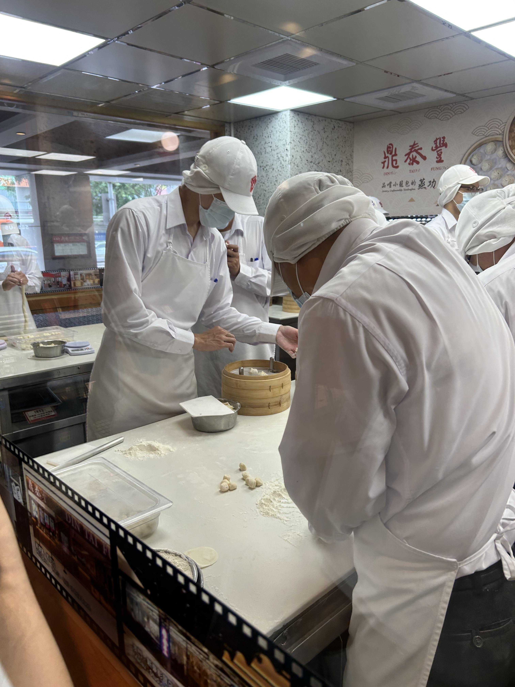
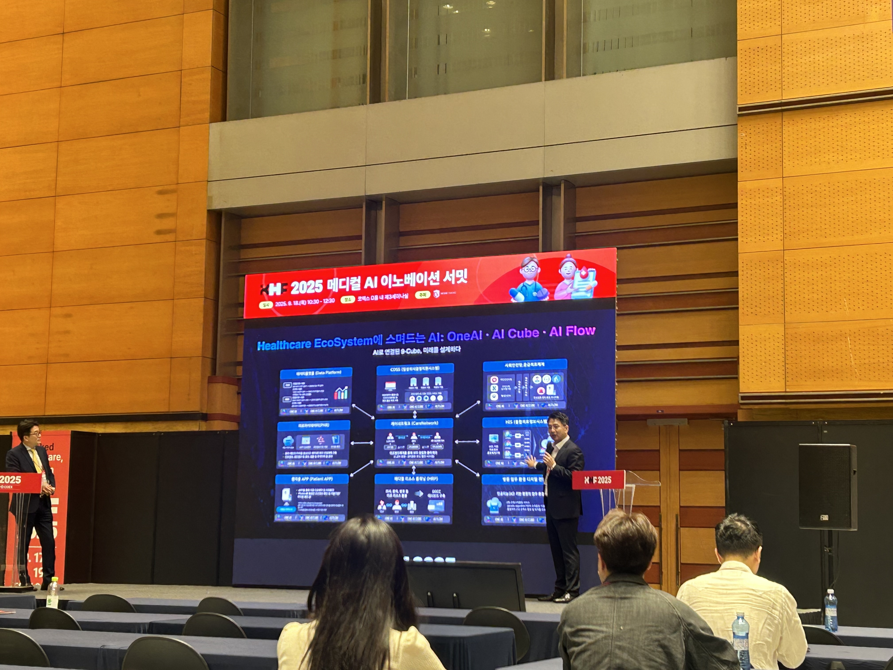
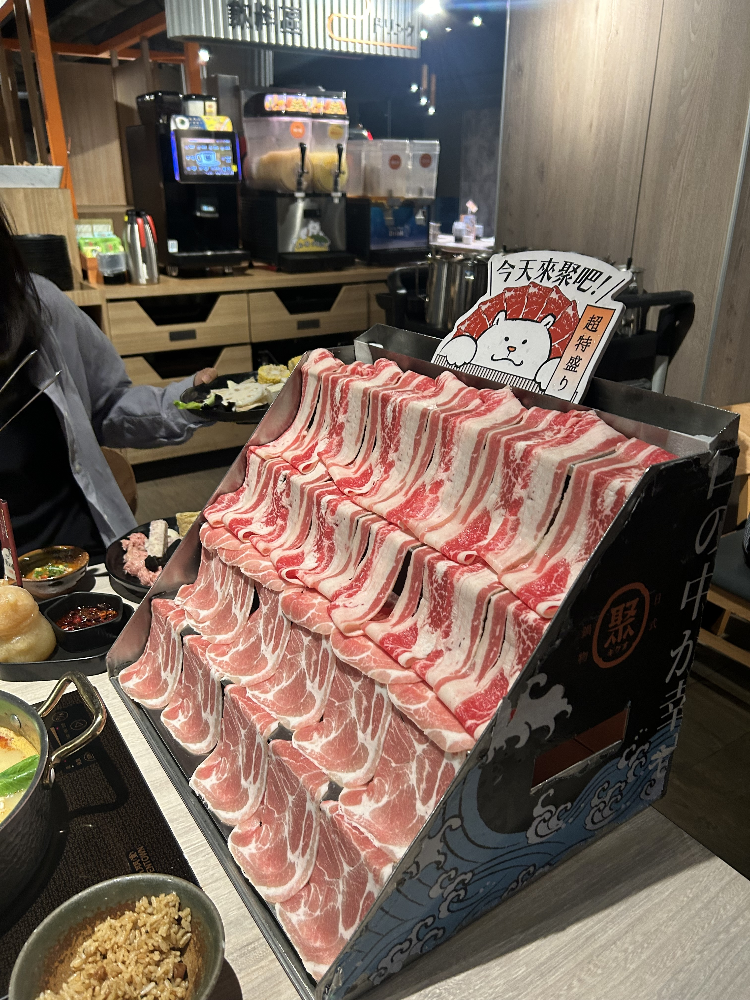

## 문제 1

Q: 다음 이미지에 대한 설명 중 옳지 않은 것은 무엇인가요?
- (1) 건물 앞에 오토바이가 여러 대 주차되어 있습니다.
- (2) 건물은 현대적인 유리 외관을 가지고 있습니다.
- (3) 나무들이 도로 옆에 줄지어 서 있습니다.
- (4) 건물의 외벽은 회색빛을 띄고 있습니다.

Listening: Which of the following descriptions of the image is incorrect?
- (1) There are several motorcycles parked in front of the building.
- (2) The building has a modern glass facade.
- (3) Trees are lined up along the road.
- (4) The exterior walls of the building have a grayish color.

정답: (2) 건물은 현대적인 유리 외관을 가지고 있지 않습니다.

---------------------

## 문제 2

Q: 다음 이미지에 대한 설명 중 옳지 않은 것은 무엇인가요?  
- (1) 사람들은 하얀색 유니폼과 모자를 착용하고 있습니다.  
- (2) 테이블 위에 밀가루와 반죽이 놓여 있습니다.  
- (3) 한 사람이 창문 너머로 음식을 주문하고 있습니다.  
- (4) 이미지 속 사람들은 요리를 준비하고 있는 것처럼 보입니다.

Listening: Which of the following descriptions of the image is incorrect?  
- (1) The people are wearing white uniforms and hats.  
- (2) There is flour and dough on the table.  
- (3) One person is ordering food through a window.  
- (4) The people in the image seem to be preparing food.

정답: (3) 창문 너머로 음식을 주문하는 사람은 없습니다.

---------------------

## 문제 3

Q: 다음 이미지에 대한 설명 중 옳지 않은 것은 무엇인가요?

- (1) 발표자가 큰 화면 앞에서 발표하고 있습니다.
- (2) 청중들이 좌석에 앉아 경청하고 있습니다.
- (3) 발표 주제는 '2025 메디컬 AI 이노베이션'입니다.
- (4) 화면에 'Healthcare System' 관련 설명이 없습니다.

Listening: Which of the following descriptions of the image is incorrect?

- (1) The presenter is giving a presentation in front of a large screen.
- (2) The audience is seated and listening attentively.
- (3) The presentation topic is '2025 Medical AI Innovation.'
- (4) There is no explanation about the 'Healthcare System' on the screen.

정답: (4) 화면에는 'Healthcare EcoSystem' 관련 설명이 있습니다.

---------------------

## 문제 4

Q: 다음 이미지에 대한 설명 중 옳지 않은 것은 무엇인가요?

- (1) 여러 줄의 고기가 진열되어 있습니다.
- (2) 뒷쪽에 음료 기계가 보입니다.
- (3) 고기 옆에 스시가 놓여 있습니다.
- (4) 판에 귀여운 동물이 그려져 있습니다.

Listening: Which of the following descriptions of the image is incorrect?

- (1) There are several rows of meat displayed.
- (2) A drink machine is visible in the background.
- (3) Sushi is placed next to the meat.
- (4) A cute animal is drawn on the board.

정답: (3) 고기 옆에 스시가 아닌 다른 음식이 놓여 있습니다.

---------------------

